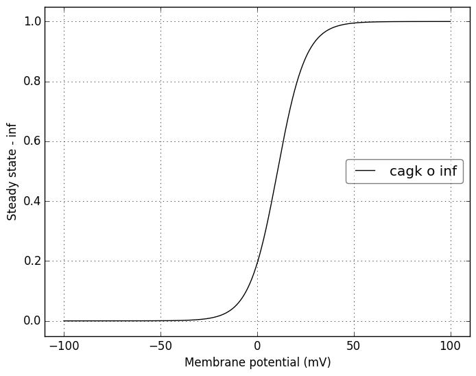
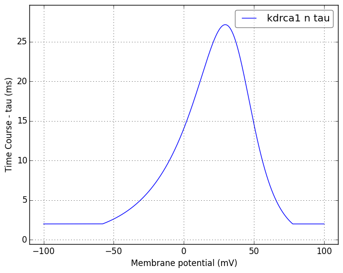

Channel information
===================
    

Channel information at: T = 35.0 degC, E_rev = 0 mV, [Ca2+] = 5e-06 mM

<table>
    <tr>
<td width="120px">
            <b>na3</b> 
            <a href="../na3.channel.nml">na3.channel.nml</a> 
            <b>Ion: na</b> 
            <i>g = gmax * m3 * h * s </i> 
            Na+ channel description (from Migliore 1997, modified in 2002)
</td>
<td>

</td>
<td>

</td>
</tr>
    <tr>
<td width="120px">
            <b>nax</b> 
            <a href="../nax.channel.nml">nax.channel.nml</a> 
            <b>Ion: na</b> 
            <i>g = gmax * m3 * h </i> 
            Na+ channel description (from Migliore 1997, modified in 2002) na3 without the slow inactivation (s - gating variable) 
</td>
<td>

</td>
<td>

</td>
</tr>
    <tr>
<td width="120px">
            <b>cagk</b> 
            <a href="../cagk.channel.nml">cagk.channel.nml</a> 
            <b>Ion: k</b> 
            <i>g = gmax * o </i> 
            Ca++ activated mAHP K+ channel description (from Moczydlowski and Latorre 1983 - modeled by Poirazi 2003, Lawrence 2006 (same parameters))
</td>
<td>

</td>
<td>

</td>
</tr>
    <tr>
<td width="120px">
            <b>kaprox</b> 
            <a href="../kaprox.channel.nml">kaprox.channel.nml</a> 
            <b>Ion: k</b> 
            <i>g = gmax * n * l </i> 
            A-type K+ channel description (from Klee, Ficker and Heinmann 1995, modeled by Migliore 1997, 2001)
</td>
<td>

</td>
<td>

</td>
</tr>
    <tr>
<td width="120px">
            <b>kd</b> 
            <a href="../kd.channel.nml">kd.channel.nml</a> 
            <b>Ion: k</b> 
            <i>g = gmax * n </i> 
            K-D channel description (from Migliore 2006)
</td>
<td>

</td>
<td>

</td>
</tr>
    <tr>
<td width="120px">
            <b>kdrca1</b> 
            <a href="../kdrca1.channel.nml">kdrca1.channel.nml</a> 
            <b>Ion: k</b> 
            <i>g = gmax * n </i> 
            Delayed rectifier K+ channel description (from Klee, Ficker and Heinmann 1995, modified by Migliore 1997 to account Dax)
</td>
<td>

</td>
<td>

</td>
</tr>
    <tr>
<td width="120px">
            <b>km</b> 
            <a href="../km.channel.nml">km.channel.nml</a> 
            <b>Ion: k</b> 
            <i>g = gmax * m </i> 
            KM channel description (from Shah, modeled by Migliore 2006)
</td>
<td>

</td>
<td>

</td>
</tr>
    <tr>
<td width="120px">
            <b>KahpM95</b> 
            <a href="../KahpM95.channel.nml">KahpM95.channel.nml</a> 
            <b>Ion: k</b> 
            <i>g = gmax * w </i> 
            Borg-Graham type generic K-AHP channel descriptions (from Borg and Graham 1995, modeled by Migliore, modified by Lazarewicz)
</td>
<td>

</td>
<td>

</td>
</tr>
    <tr>
<td width="120px">
            <b>cal</b> 
            <a href="../cal.channel.nml">cal.channel.nml</a> 
            <b>Ion: ca</b> 
            <i>g = gmax * h * m2 </i> 
            L-type Ca++ channel description (from Jaffe 1994 - modeled by Lawrence 2006, modified by Migliore)
</td>
<td>

</td>
<td>

</td>
</tr>
    <tr>
<td width="120px">
            <b>can</b> 
            <a href="../can.channel.nml">can.channel.nml</a> 
            <b>Ion: ca</b> 
            <i>g = gmax * h2 * m2 * h </i> 
            N-type Ca++ channel description (modeled by Migliore)
</td>
<td>

</td>
<td>

</td>
</tr>
    <tr>
<td width="120px">
            <b>cat</b> 
            <a href="../cat.channel.nml">cat.channel.nml</a> 
            <b>Ion: ca</b> 
            <i>g = gmax * m2 * h </i> 
            T-type Ca++ channel description (modeled by Migliore)
</td>
<td>

</td>
<td>

</td>
</tr>
    <tr>
<td width="120px">
            <b>hd</b> 
            <a href="../h.channel.nml">h.channel.nml</a> 
            <b>Ion: non_specific</b> 
            <i>g = gmax * l </i> 
            H-current description, using non_specific current (from Magee 1998, modeled by Migliore)
</td>
<td>

</td>
<td>

</td>
</tr>
</table>

